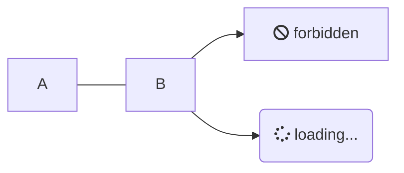

## Notes

Testing mermaid plugin here:

```mermaid
    graph LR
    A --- B
    B-->C[fa:fa-ban forbidden]
    B-->D(fa:fa-spinner loading...);
```

<pre class="mermaid">
    graph LR
    A --- B
    B-->C[fa:fa-ban forbidden]
    B-->D(fa:fa-spinner loading...);
</pre>
